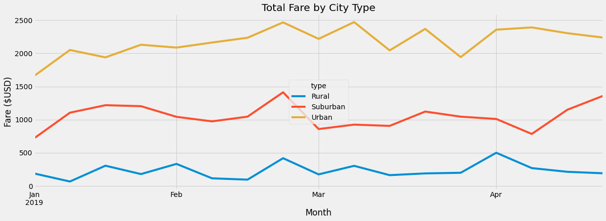

# PyBer Analysis

## PyBer Analysis Overview

This project utilized the Pandas library and Matplotlib in Python to analyze ride-sharing data for the company PyBer. CSV files containing fare and driver information for urban, suburban, and rural cities were imported and analyzed to gain insight into ride fares broken down by city type. A summary data frame was initially generated to investigate average fares per ride and average fares per driver for each city type. A multiline plot was also generated using Matplotlib to show the total weekly fares for each type of city from January through April 2019. The code for this project was developed in Jupyter Notebook using Python version 3.8.8.

### PyBer Analysis Purpose

The overall purpose of this project was to enhance students' skills with the Pandas library and develop familiarity with Matplotlib for plotting in Python. Throughout the module, the number of drivers, the number of rides, and fare information broken down by the type of city was investigated. For the challenge, the average fare per ride and average fare per driver were broken down by city type, and the total fare by city type was plotted for the months of January-April 2019. The analysis performed in this module and challenge could assist an organization in making business decisions regarding resource allocation in various types of cities.

## PyBer Analysis Results

Ride-sharing data for a group of urban, suburban, and rural cities was analyzed to determine trends related to the type of city. To begin the analysis, city-specific data and ride-specific data was imported into Jupyter Notebook for analysis following an initial inspection of each CSV file. A Pandas data frame was created for each data set, and the two data frames were merged into a single data frame on the 'city' column as the city data was common to both data sets. This merged data frame is shown in Fig. 1.

*Figure 1. Merged PyBer data frame*

From there, the total number of rides and total number of drivers along with average fares per ride and average fares per driver were determined for each type of city. The code to perform the analysis, create a new data frame with the results, and format the new data frame is shown in Fig. 2.

*Figure 2. Python code to compute average fare per ride and average fare per driver*

The data frame summarizing the analysis is shown in Fig. 3. The data in Fig. 3 is interesting in that the average fare per ride does not show a large deviation among city types compared to the average fare per driver. Compared to suburban cities, there is roughly a 12% difference in the fare per ride for rural cities and roughly a 21% difference in fare per ride for urban cities. The fare per driver, on the other hand, shows much larger deviation. Compared to suburban cities, there is roughly a 40% difference in the fare per driver for rural cities and roughly a 58% difference in fare per driver for urban cities. This suggests that perhaps the driver count in the different city types should be addressed. This is further discussed in the summary section.

*Figure 3. Summary of average fares per ride and average fares per driver for rural, suburban, and urban cities*

Following the analysis outlined above, the data was further analyzed to investigate potential seasonality in the use of PyBer's ride-sharing servies for each city type. A multiline chart was created using Matplotlib to plot the total fare collected for each city type from January through April 2019. To create the chart, a pivot table and a new data frame were generated from the original merged data frame shown in Fig. 1.

The code to generate the pivot table, new data frame, and line chart is shown in Fig. 4.

*Figure 4. Python code to generate pivot table, new data frame, and multiline chart for total fare by city type from January through April 2019*

The data was grouped by type and date, and the fares were summed. The third block of code containing the line 'pyber_date_type_pivot = pyber_date_type_df.pivot(index="date", columns="type", values="fare")' is where the pivot table was generated. Notice in the fourth block of code, the date range '2019-01-01':'2019-04-29' was selected using '.loc' on the pivot table to generate a new data frame.

One of the keys to this portion of the analysis was setting the index datatype in the new data frame to 'datetime' enabling the data to be resampled based on weeks. The code to reset the index is shown in the fifth block of code, and the sixth block of code investigates the datatypes for the data frame. Notice the output from the sixth block of code shows that the index of this data frame is a 'datetime' index.

The seventh block of code in Fig. 4 shows the code to resample the data frame in weeks, 'W', and Fig. 5 shows the resulting data frame resampled in weeks. The multiline chart shown in Fig. 6 was generated from the data frame in Fig. 5.

*Figure 5. Data frame for weekly fares collected from January through April 2019*

*Figure 6. Multiline chart showing weekly fares collected from January through April 2019*

The lines in Fig. 6 remain relatively flat over the period of time shown indicating that there was not a significant amount of seasonality in the total fares collected from January to April 2019. However, there could be more or less ride-sharing use in the summer and fall months, and the amount of ride sharing use could change for different city types depending on the time of year. This is further outlined in the following section. It is clear from the line chart that the total fares were consistently highest for urban cities, second highest for suburban cities, and lowest for rural cities over the timeframe considered. This supports the amounts for total fares found in the summary data frame presented in Fig. 3.

## PyBer Analysis Summary

In consideration of the analysis performed in this challenge, the following three recommendations are presented to the PyBer CEO regarding ride-sharing services.

1. It is recommended that PyBer increase the number of drivers in rural areas, and decrease the number of drivers in urban areas.
    - The number of rides was approximately 60% more than the number of drivers in rural cities meaning that the drivers in rural cities were likely overworked, and some revenue was probably lost due to a lack of available drivers. Furthermore, the fare per ride and fare per driver were relatively high compared to fares in suburban and urban cities. Part of this is likely due to longer commutes, but it could also be driven by supply and demand depending on the pricing strategy PyBer uses. Increasing the number of drivers in rural areas could drop these fares and increase the number of rides.
    - The number of rides was approximatley 32% less than the number of drivers for urban cities implying that some drivers were left without available passengers. Depending on the compensation approach for PyBer, this could mean salary and benefits were paid for drivers that had no work. Cutting the number of drivers could cut operating expenses without impacting the number of rides. This would increase the average fare per driver, but this should not mean a cost increase for fares passed on to customers.

2. PyBer should monitor ride-sharing data for the full year as well as year-to-year to determine any trends in seasonality. It is possible that different city types could see varying levels of ride-sharing use in different times throughout the year.

3. As an extension of the previous recommendation, PyBer should further break down ride-sharing data for geographical regions where PyBer offers services. This could provide insight into regional trends or seasonalities allowing PyBer to more accurately forecast demand and staff accordingly. The amount of urban ride-sharing could increase or decrease in the summer months depending on the location. In places like the northeastern United States for instance, people could decide to walk to their destinations as the weather warms decreasing ride-sharing use. However, in places like Orlando, Florida, people could elect to use more ride-sharing during the summer when it is very hot and walking is not as desirable. For rural areas on the other hand, it is expected that ride-sharing would not exhibit significant changes throughout the year. In rural areas, ride-sharing is more likely a matter of necessity rather than convenience.
